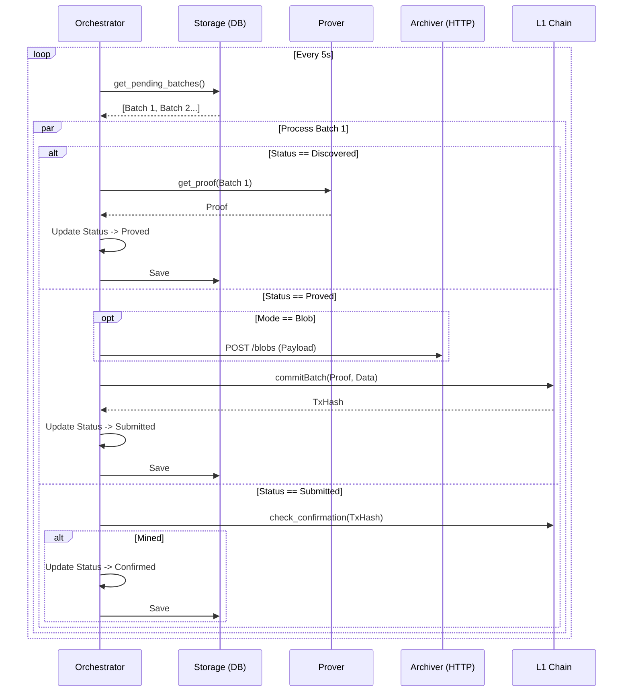

# Architecture

The Submitter Daemon follows a **Domain-Driven Design (DDD)** approach with a **Hexagonal Architecture** (Ports and Adapters). This ensures the core logic is isolated from external dependencies like databases, blockchains, and HTTP services.

## 1. Domain Layer (`src/domain/`)

The innermost layer containing pure business logic and type definitions. It has zero external dependencies.

*   **Entities**:
    *   `Batch`: The aggregate root. Tracks ID, status, data pointers, and retry counts.
*   **Value Objects**:
    *   `BatchId`: A UUID v5 generated deterministically from batch parameters to ensure idempotency.
*   **Enums**:
    *   `BatchStatus`:
        *   `Discovered`: Ingested from the Sequencer/DB.
        *   `Proving`: Request sent to ZK Prover.
        *   `Proved`: Proof received.
        *   `Submitting`: Transaction construction in progress.
        *   `Submitted`: Tx broadcasted to L1.
        *   `Confirmed`: Tx mined and settled.
        *   `Failed`: Terminal error state.

## 2. Application Layer (`src/application/`)

Contains the orchestration logic that drives the domain entities through their lifecycle.

### The Orchestrator Loop
The `Orchestrator` service runs an infinite loop (polled via `tokio::time::sleep`) that performs the following steps:

### Ports (Traits)
Interfaces defined in `ports.rs` that the Application layer depends on:
*   `Storage`: `save_batch`, `get_batch`.
*   `ProofProvider`: `get_proof`.
*   `DaStrategy`: `submit`, `check_confirmation`.
*   `BridgeReader`: `state_root`.

## 3. Infrastructure Layer (`src/infrastructure/`)

Contains the concrete implementations (Adapters).

### DA Strategies
*   **CalldataStrategy**: Encodes batch data into the `batchData` calldata field.
*   **BlobStrategy**: Creates an EIP-4844 transaction. Encodes the `VersionedHash` in `daMeta`, attaches the blob as a sidecar, and **archives the blob** to an external service via HTTP.

### Prover Adapters
*   **HttpProofProvider**: Sends JSON payload to a real ZK Prover service. Implements a **Circuit Breaker** (using the `failsafe` or internal logic) to back off if the prover is overloaded.
*   **MockProofProvider**: Used for simulation. Accepts a configuration `mock_proving_time_ms` to sleep, simulating computation latency.

## 4. Simulation Layer

To support the FYP research objectives without building a full-scale Sequencer, the architecture includes simulation components:

*   **Mock Executor**: A Python script that injects batches into the database, respecting `BATCH_SIZE` and `BATCH_TIMEOUT` to simulate throughput.
*   **Metrics**: The system emits Prometheus metrics specifically tailored to measure the latency introduced by each stage, allowing for "Pareto Frontier" analysis (RQ2).
